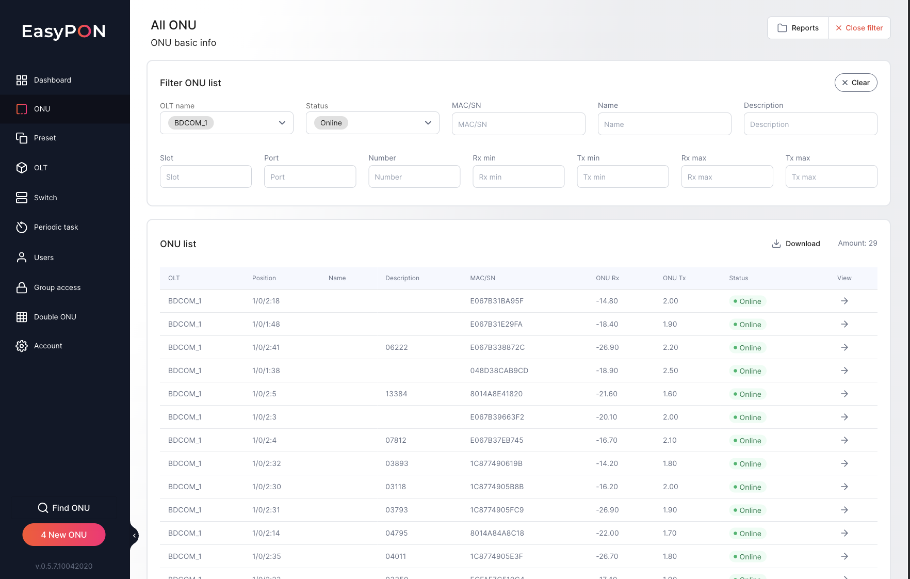

In the ONU main menu section, the All ONU page displays the list of ONU available in the EasyPON system In a summary table it is possible to filter and open a specific ONU page. It is also possible to Download filtered ONU table and download reports in [Reports](https://app.archbee.com/docs/TzlFsLikA7TqxqriFHwd8/nsviDpiegg1WUNi2IeChX) section.

# Filter ONU list

The page consists of Filters ONU list, by which it is possible to search for ONUs by all available criteria fields.

The Filter ONU list panel can be used to filter data in the ONU list table by the following criteria fields:

*   MAC/SN - ONU MAC address/serial number

*   Name - ONU name

*   OLT Name - a drop-down list with the names of available OLTs in the EasyPON system

*   Status - ONU active status

*   Slot - slot number

*   Number – ONU number on the port

*   Port - ONU port number

*   Rx min - the minimum value of the Rx signal

*   Rx max – the maximum value of the Rx signal

*   Tx min - the minimum value of the Tx signal

*   Tx max – the maximum value of the Tx signal

When a filter is applied, it is saved when moving between ONU cards and the All ONU page.

# ONU list

ONU list - a list of ONUs registered in the system in a tabular form with the following data:

*   OLT - the name of the OLT on which the ONU is registered

*   Position - position of the ONU on the OLT. The data is defined in the format Shelf/Slot/Port\:Number.

*   Name - ONU name in the EasyPON system

*   Description - short description of the ONU

*   MAC/SN - ONU MAC address/serial number

*   ONU Rx - the last received RX signal during the last polling of ONU signals

*   ONU Tx - the last received TX signal during the last polling of ONU signals

*   Status - ONU active status

*   View - a link to view the ONU. When clicked, a page with detailed information about [ONU](https://app.archbee.com/docs/TzlFsLikA7TqxqriFHwd8/DbMW7mA-4zgfHBV24WkGQ) is opened.

