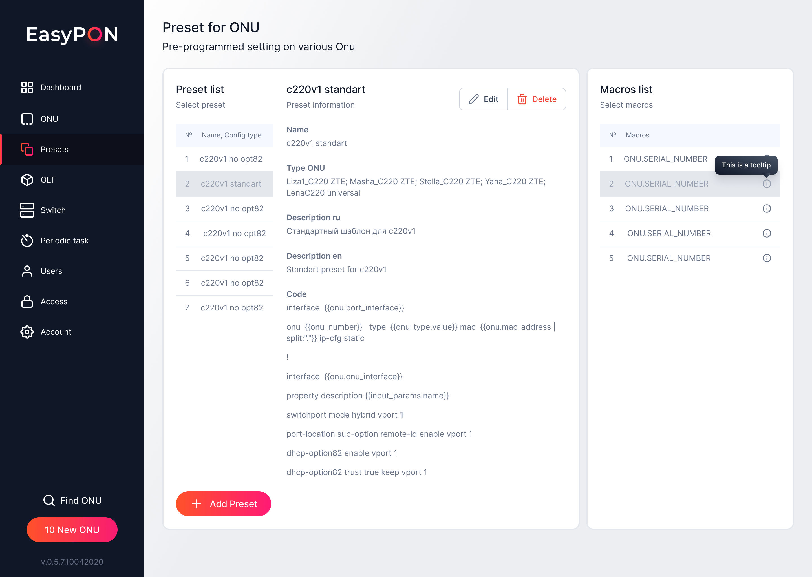

By pressing the Delete button, you can delete the selected Preset after confirmation. After deleting preset all preset configuration data will be lost.

If you want to keep preset configuration data, it is possible to keep empty preset without OLT, ​ONU technology and ​ONU type parameters and add them later.

