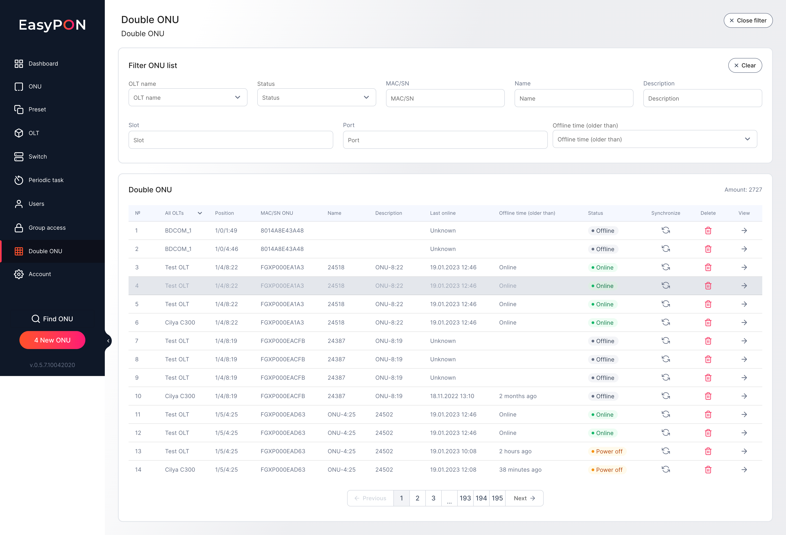

The Double ONU page displays the list of duplicated ONUs in the EasyPon system. In the Double ONU table, it is possible to see the following fields with information on each duplicated ONU:

*   № - sequence number in the table

*   OLT name - OLT title on which the ONU is registered. A filter is displayed on this field. It is possible to choose OLT for filtering in the table.

*   Position - Position of the ONU on the OLT

*   MAC/SN ONU - mac address or the serial number of the ONU

*   Description - detailed description of the ONU

*   Last online - date and time when the ONU was online

*   Offline time - the amount of time ONU has been offline

*   Status - ONU active status

*   Synchronize - ONU synchronization button

*   Delete - button to remove the ONU

*   View - button to view the ONU card

