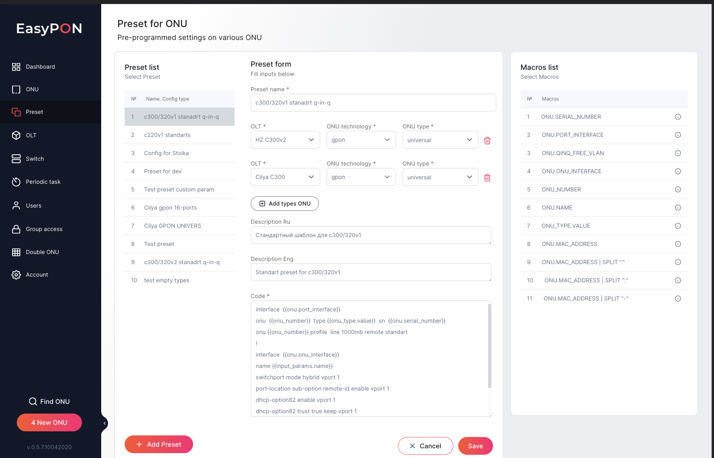

It is possible to edit the selected Preset by pressing the Edit button and opening the edit form, where the necessary Preset data can be modified. The available fields for editing:&#x20;

*   Preset name - preset title

*   ONU Type - selected ONU types to which the Preset corresponds

*   Description RU - a detailed description of the Preset in Cyrillic

*   Description EN - a detailed description of the Preset in English

*   Code - Preset configuration script with the values of the macros.

