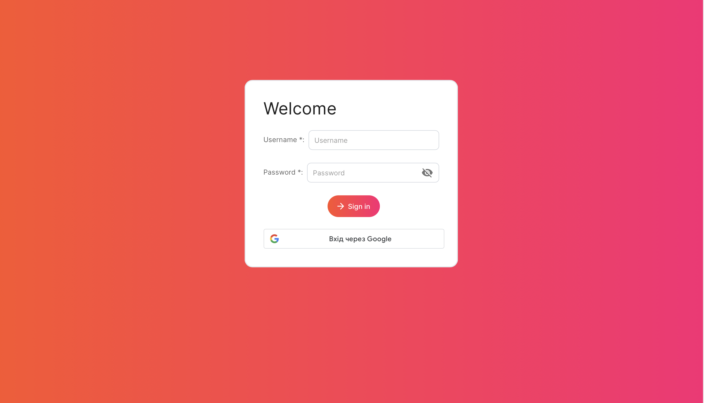

You can use the Sign In form to log into the EasyPON system. To do this, fill in the Username and Password fields and click Sign In.

After logging in, the user will be moved to the Dashboard page, from which you can start working with the EasyPON system. It is also possible to use the login through a corporate Google Account.

> It is possible to obtain data for accessing the EasyPON system from the system administrator or by login in with your corporate email address.

