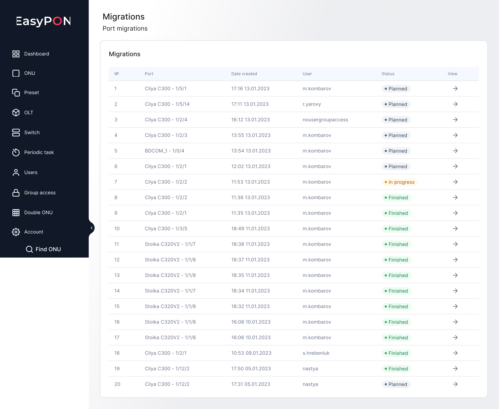
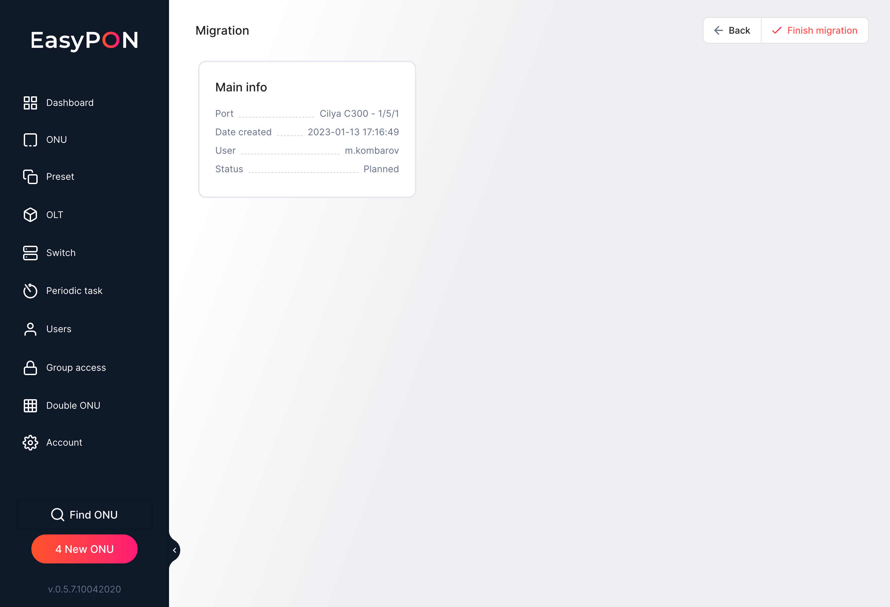
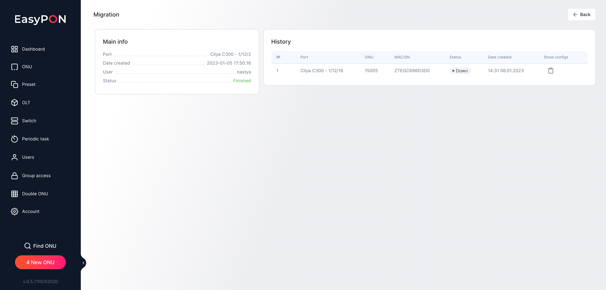

All planned, In the process, and finished port migrations can be found on the Migrations page. You can find OLT name shelf/slot/port info, the date the migration has been created, the user started the migration process, its current status, and View action.

## Specific migration page

On the specific migration page, the Main info on port migration can be located. There are few parameters can be seen in the Main info block:

*   Port - OLT name shelf/slot/port

*   Date created - the date the migration has been created at

*   User - the user requested the migration process

*   Status - the migration status. The are three of them: Planned, In the process, and Finished

There is also a History block showing all ONUs which are migrated with the parameters:

*   Port - OLT name shelf/slot/port

*   ONU - ONU name

*   MAC/SN - MAC address or ONU serial number

*   Status - ONU status

*   Date created - the date ONU has been migrated

*   Show configs action - view ONU configs in the terminal

