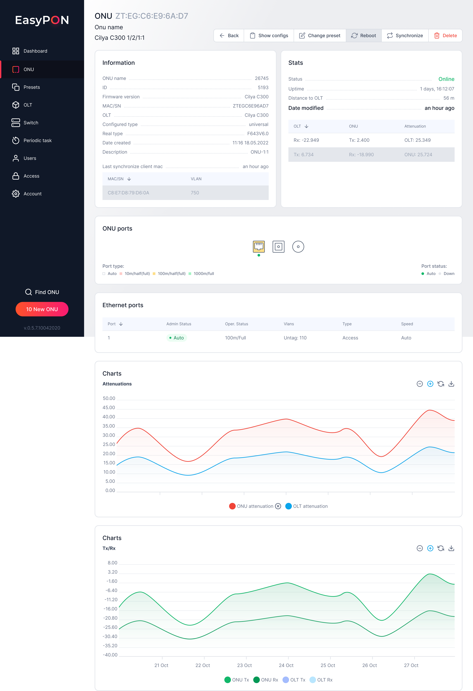
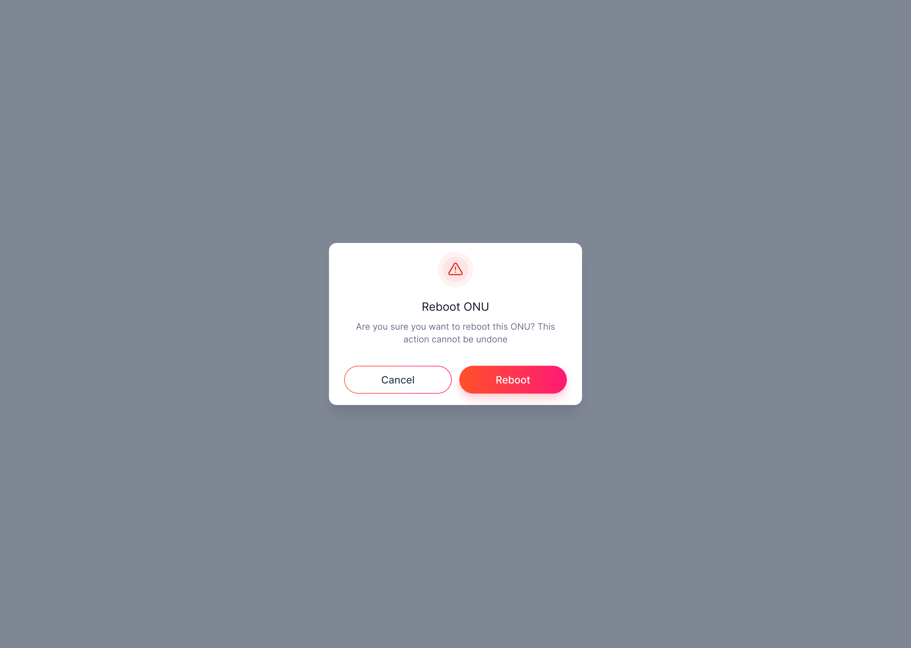
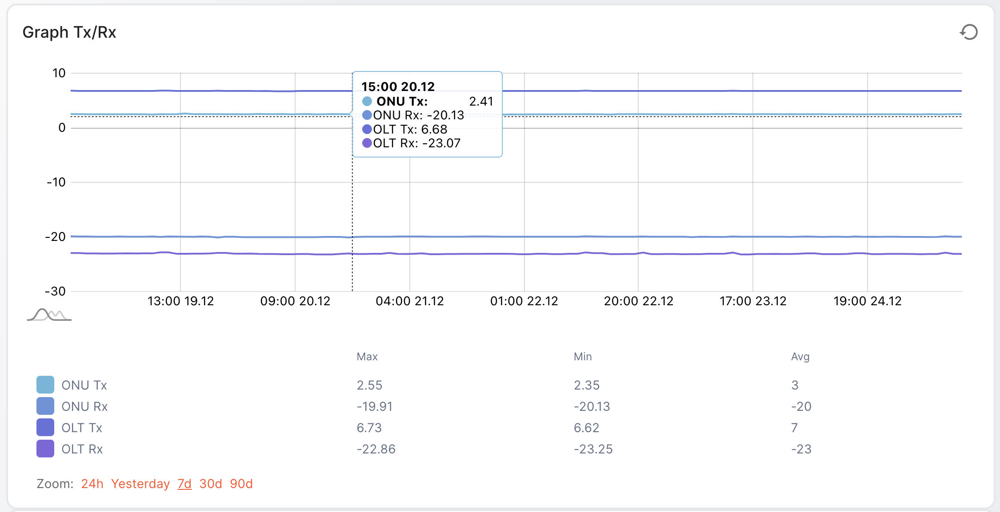
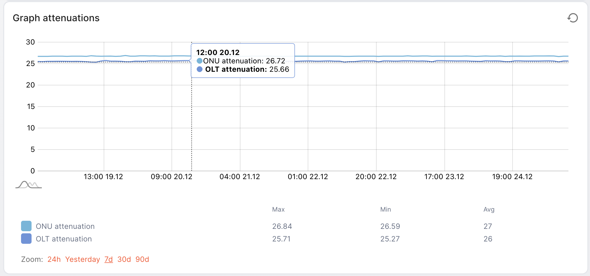

The ONU page displays data on the selected ONU and consists of several sections:

*   Quick actions panel - quick commands are available on the quick actions panel that can be executed on the page or from the ONU

*   Information - general information about ONU

*   Stats - Display of ONU statistical data

*   ONU Ports - ONU display with available ports and their status

*   Ethernet ports - display of ONU Ethernet ports

*   Charts - graphs with optical signal readings are displayed

The header additionally displays information about the ONU's MAC/SN. ONU name and description and OLT name with ONU position on OLT in "Shelf/Slot/Port\:Number" format.

*   Shelf - ONU position

*   Slot - slot number

*   Port - ONU port number

*   Number – ONU number on the OLT port

# Quick Actions Panel

On the quick actions panel, quick commands are available that can be executed on the page or from the ONU:

*   Back - switch to the ONU list

*   Show configs - display in the ONU configuration console

*   Change preset - change the ONU configuration

*   Reboot - ONU reboot

*   Synchronize - ONU synchronization with OLT

*   Delete - delete the ONU from the OLT

# Information

General information about ONU.

*   ONU name - ONU name provided during registration

*   ID - ONU identifier

*   Firmware version - firmware version

*   MAC/SN - mac address or serial number of the ONU

*   OLT - the name of the OLT on which ONU is registered

*   Configured type - ONU configuration type

*   Real Type - ONU type

*   Date created - ONU registration date

*   Description - a detailed description of the ONU

*   Last synchronize client mac - a table of client MAC addresses assigned to the ONU

# Stats

Displaying ONU statistical data in sections:

*   Status - ONU status

*   Uptime - a time stamp that shows how many ONUs are online

*   Date modified - a time marker that shows how much time has passed since the last modification of the ONU

*   Rx/Tx indicators on OLT, ONU, and signal attenuation (Attenuation)

# ONU Ports

ONU display with available ports and their status. The connected port type and its operational status.

*   Port type - port type (Auto, 10m/half(full), 100m/half(full), 1000m/full)

*   Port status - administrative port status (Auto, Down)

# Ethernet Ports

*   Admin status - the administrative status of the Ethernet port (can be Auto or Down)

*   Oper. status - operational status

*   Vlans - available Vlans ports

*   Type - port type

*   Speed - port speed

# Charts

This section displays graphs with readings of the optical signal, collected by periodic polling once every set number of minutes (hours). Attenuations and Tx/Rx signals are displayed in separate graphs.

# Graph Tx/Rx

The graph represents the readings of the optical Tx/Rx signal. It is possible to view data statistics for the last 24 hours, yesterday, 7, 30, and 90 days ago.

Press the indicator in the legend to isolate its view on the graph or press back to select and view all data again. You can also press the Command key on Mac or Windows key on PC for multiple indicators selection and viewing them on the graph.

# Graph attenuations

The graph represents the readings of the attenuation signals on OLT and ONU. It is possible to view data statistics for the last 24 hours, yesterday, 7, 30, and 90 days ago.

Press the indicator in the legend to isolate its view on the graph or press back to select and view all data again. You can also press the Command key on Mac or Windows key on PC for multiple indicators selection and viewing them on the graph.

