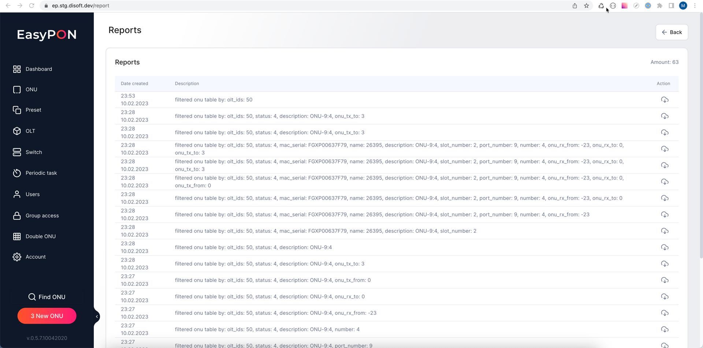
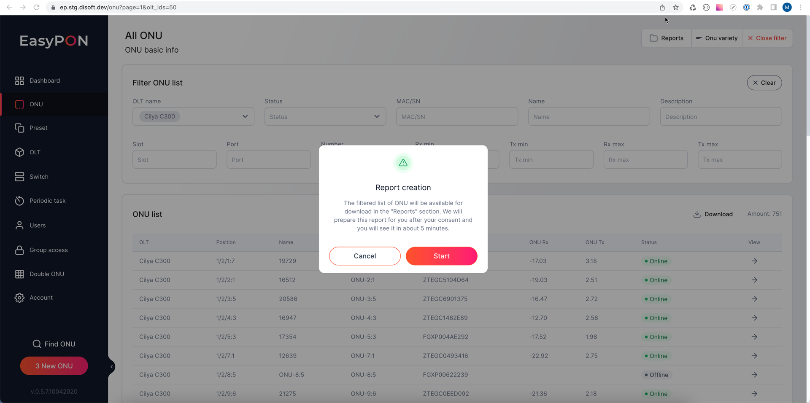
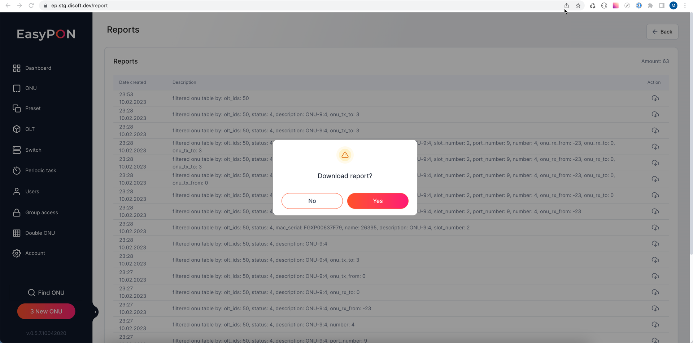

Download generated reports from the ONU list section. The reports are generated in electronic table format.

Reports can be generated by applying filters to the ONU list, pressing the Download button, and confirming report generating process

After report generation, you can download the generated report from the Reports list for the last 30 days.

The generated report contains the following fields

*   olt - OLT title

*   config\_type - config type

*   onu\_position - ONU position

*   number - ONU number on port

*   name - ONU name

*   description - ONU description

*   date\_create - timestamp of ONU registration&#x20;

*   date\_modified - timestamp of ONU status has been modified&#x20;

*   serial - ONU serial number

*   mac	- ONU mac address

*   real\_type - ONU real type

*   onu\_status - ONU active status

*   qinq\_vlan - ONU qinq vlan

*   uptime - ONU uptime

*   last\_online - time stamp when last online

*   onu\_magic - ONU magic number

*   firmware\_version - ONU firmware version

