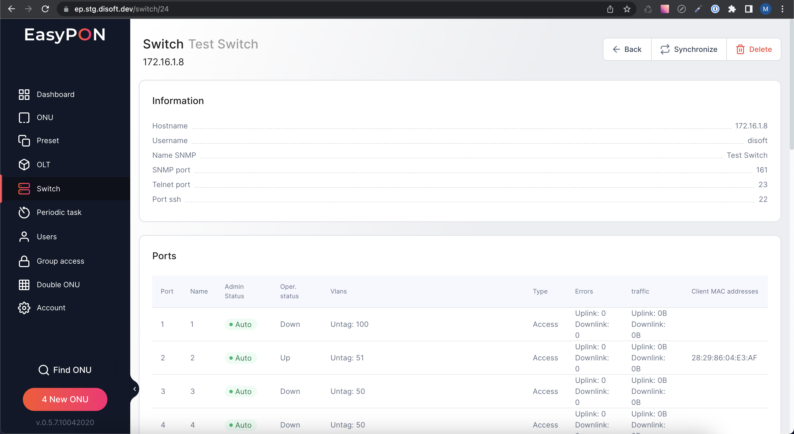

View information about a specific Switch:

*   Quick Actions Bar

*   Information - display of basic information about the world

*   Ports - display information about the switch port

You can change the Admin Status on the switch port. Also, each port displays the client MAC addresses on which the global search works.

# Quick Actions Bar

The following actions are available on the Switch page:

*   Back - go to switch list

*   Synchronize - synchronization of main switch data

*   Delete - delete of switch

# Information

The block with the fields:

*   Hostname - host title

*   Username - user account name&#x20;

*   Name SNMP.- name SNMP

*   SNMP port - port SNMP

*   Telnet port - port Telnet

*   Port ssh - port  ssh

# Ports

The block displays the list of ports on the switch in tabular form. The following information is available in the table:

*   Port - Switch port number

*   Name - Switch name

*   Admin Status - the administrative status of the Switch port

*   Oper Status -the operational status of the Switch port

*   Vlans - number and type of Vlans

*   Type - port type Switch

*   Errors - number of Uplink and Downlink data errors

*   Traffic - the amount of Uplink and Downlink traffic data

*   Client mac addresses - client mac addresses on the Switch port

## Admin Status change

By clicking on the port Admin Status icon in the table, you can change the administrative status on the Switch port.

