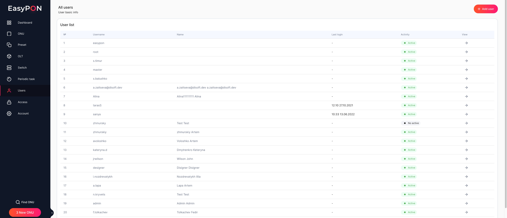
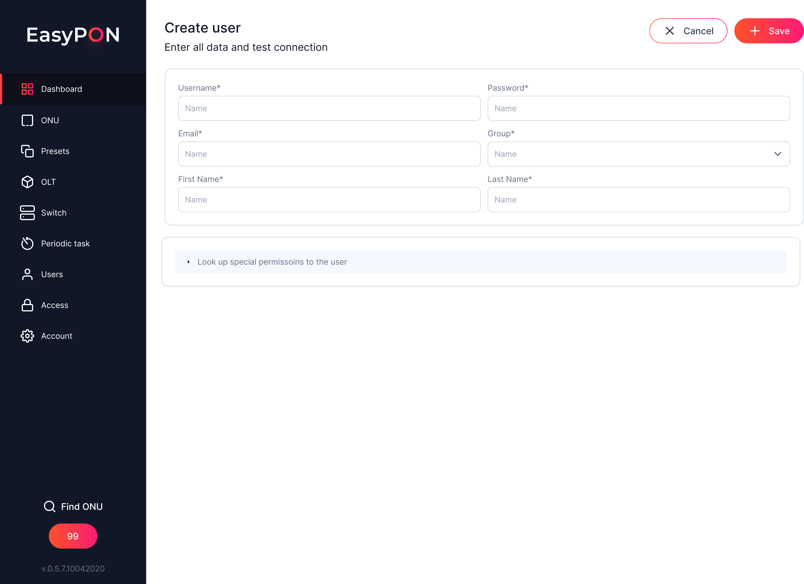
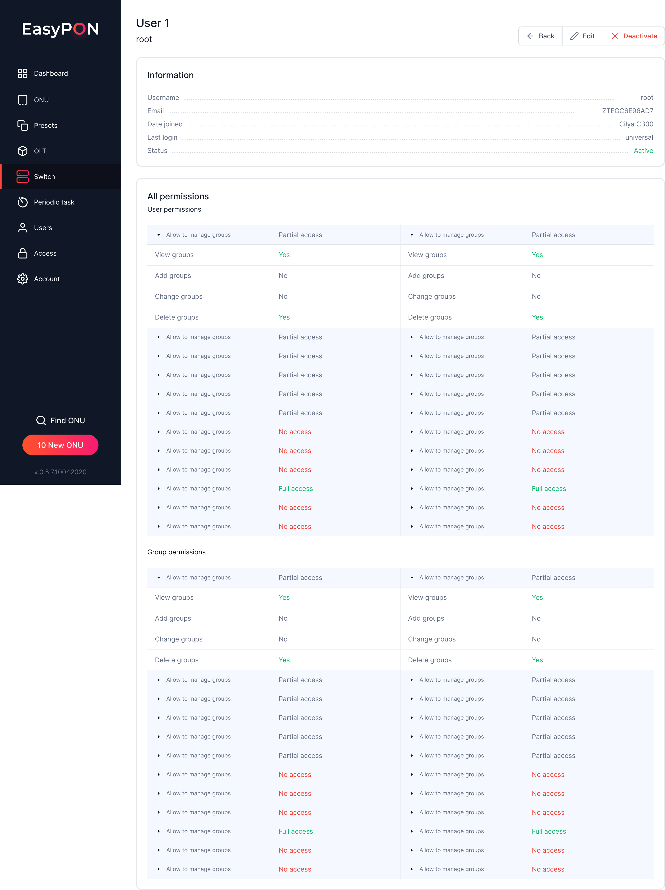
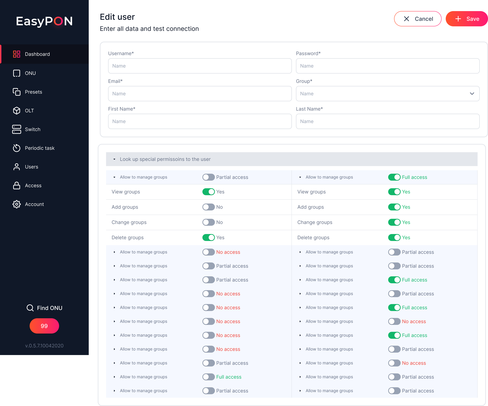

> The section may not be displayed due to the limited access permissions of your account.

The Users section displays the list of users available in the EasyPON system and is displayed in the form of a table with fields:   &#x20;

*   № - sequence number in the User list table

*   Username - user account name

*   Name - full user name

*   Last login - the date and time of the user's last login

*   Activity – сaccount status. Available values are Active and No Active

*   View – link to view the registered user profile page.

# User creation

The Create user form displays the following fields for filling:

*   Username - the name of the user's account by which he can log in to the EasyPON system.

*   Password - the user password, which will be used to log in to the EasyPON system. The value of the field is automatically generated but can be changed when the account is created.

*   Email - user email address

*   First name - user name

*   Last name - user surname

*   Group - the permission group assigned to the user. You can read more on [Group access](https://app.archbee.com/docs/TzlFsLikA7TqxqriFHwd8/Im7vwaMN7zMOZSwvWoA5y) in the appropriate section.

*   Individual permissions for the user - individual user permissions. Individual user permissions have higher priority status over permission groups.

# User page

After clicking the View link in the User list table, the page with data about a specific user opens.

## Quick Actions Bar

The user data page displays the buttons Back - return to the User list and Deactivate - deactivation of the user account in the system. After deactivation, the user will be blocked and will not be able to use the EasyPON system.

## Information

The Information block displays the following user data:

*   Username - user account name

*   Email – user's email address

*   Date joined - date and time of account creation

*   Last login - date and time of the last login

*   Status - account status

### All permissions&#x20;

Displaying user access rights in the User permission and Group permissions sections. If the user has full access to the permission group, it will be marked as Full Access, if the rights are limited, then the group can have Partial Access. If the user does not have the rights of visible rights in the group of permissions, it will be marked as No Access.

# Editing a user

The Edit user edit form displays the following fields for filling:

*   Username - the name of the user's account by which he will be able to enter the EasyPON system.

*   Password - the user's password, which he can use to enter the EasyPON system. The password can be changed when the account is edited.

*   Email - user email address

*   Group - the permission group assigned to the user. You can read more on [Group access](https://app.archbee.com/docs/TzlFsLikA7TqxqriFHwd8/Im7vwaMN7zMOZSwvWoA5y) in the appropriate section.

*   First name - user name

*   Last name - user surname

*   Special permissions for the user

