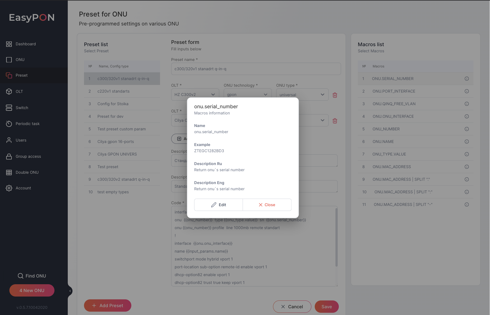

Clicking on the view icon opposite a specific Macros opens a modal window with Macros details. The following fields are available:

*   Name - Macros title

*   Example - an example value

*   Description ru - description of Macros in Cyrillic

*   Description en - description of Macros in English

From this modal window, it is also possible to edit Macros by pressing edit or close it by pressing the Close button.

##

