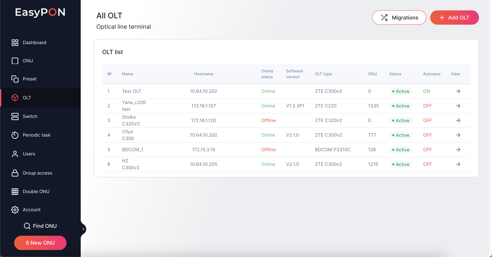

# All OLT

The All OLT page displays a table with a list of registered OLTs in the system with the following data

№ - is the serial number in the table

Name - how OLT is called

Hostname -IP address of the host

ONU - the number of connected ONUs on the OLT

Status - current OLT status

Autosave - autosave (On/Off)

View - button to view detailed information about the OLT by switching to the page [OLT](https://app.archbee.com/docs/TzlFsLikA7TqxqriFHwd8/kPwRlOlzYiioLTyFeHgLz)

<figure><figcaption></figcaption></figure>

## Add OLT

The Add OLT button opens the form for creating a new OLT Create OLT. On this page, it is possible to add a new OLT to the system and check the connection with the OLT before adding it using the Test Connection button.

The Add OLT form consists of the following fields:

OLT Name - OLT title to identify it in the EasyPON system

Type OLT - the type of current OLT

IP address - IP address of the OLT

Shel - shelf number on the OLT

SNMP read community - SNMP sequence for reading OLT statistics

SNMP write community - SNMP sequence for recording OLT statistics data

SNMP port

Telnet login

Telnet password&#x20;

Telnet port

Autosave (On або Off)

## Edit OLT

OLT information can be edited by pressing the Edit button in the Quick Actions Bar section on the OLT page. To edit the OLT you need to modify data fields and then Save the form.

## Test connection

You can also Check the connection with the existing OLT on the OLT page or before saving the OLT add/edit form results by pressing the "Test Connection" button.

<figure><figcaption>
Test connection in complete
</figcaption></figure>
