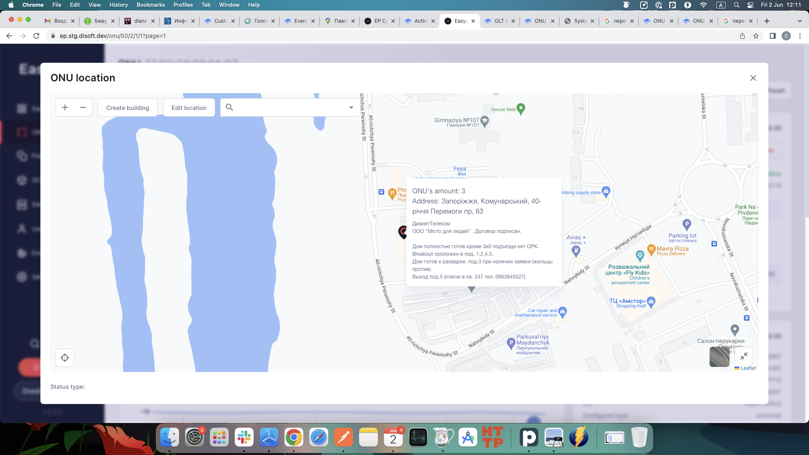

# Event log

The Event log section serves as a record of events and actions that occur within an organization. It maintains a chronological sequence of events, capturing important information such as timestamps, descriptions, and relevant details about each event. By capturing and preserving a detailed account of events, it becomes a valuable resource for troubleshooting, analysis, and security purposes.

<figure><figcaption></figcaption></figure>
