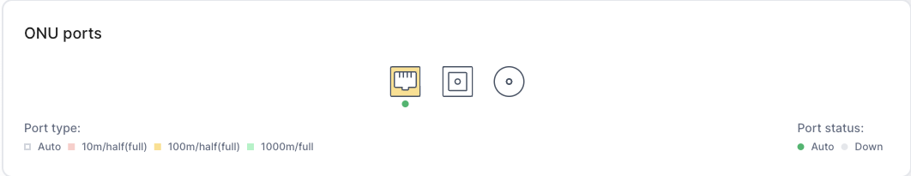
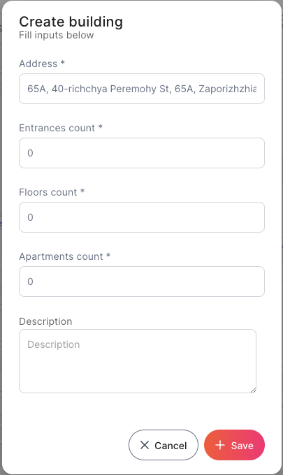
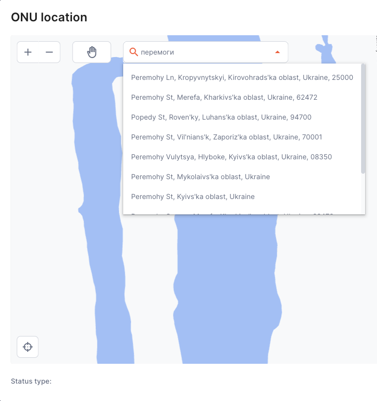
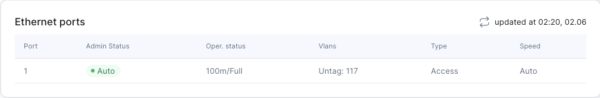

# ONU detailed info

[Quick actions panel](onu.md#quick-actions-panel) - quick commands are available on the quick actions panel that can be executed on the page or from the ONU\
[Information](onu.md#information) - general information about ONU\
[Stats](onu.md#stats) - Display of ONU statistical data\
[ONU Ports](onu.md#onu-ports) - ONU display with available ports and their status\
[ONU location](onu.md#onu-location) - functional of pointing ONU on the map and changing it\
[Ethernet ports](onu.md#ethernet-ports) - display of ONU Ethernet ports\
[Charts](onu.md#charts) - graphs with optical signal readings are displayed\
[Graph Tx/Rx](onu.md#graph-tx-rx) - the graph represents the readings of the optical Tx/Rx signal\
[Graph attenuations](onu.md#graph-attenuations) - the graph represents the readings of the attenuation signals on OLT and ONU\

The header additionally displays information about the ONU's MAC/SN. ONU name and description and OLT name with ONU position on OLT in "Shelf/Slot/Port:Number" format.

* **Shelf** - ONU position

<!---->

* **Slot** - slot number

<!---->

* **Port** - ONU port number

<!---->

* **Number** – ONU number on the OLT port

## Quick Actions Panel

On the quick actions panel, quick commands are available that can be executed on the page or from the ONU:

* **Docs** - a hyperlink to the current ONU configuration page.&#x20;
* **Back** - return to the [All ONU](all-onu.md) section.
* **Sync** - synchronize and update the latest ONU information in the EasyPON.
* **Configs** - display the current ONU config in the [ONU CLI](onu-command-line-interface.md).
* **Preset** - change the ONU configuration with the saved [Preset](../configuration-features/presets.md).
* **Action** - change custom ONU configuration by applying saved [Action](../configuration-features/custom-action.md).
* **Logs** - redirect us to the [Event logs](https://ep.stg.disoft.dev/log?base\_content\_type=21\&base\_object\_id=5193\&itemTitle=1%2F2%2F1%3A1\&page=1) page.
* **Reboot** - reboot ONU. It may be in offline or reboot status mode during the process.&#x20;
* **Delete** - delete ONU from OLT in EasyPON. After deletion, it will be shown in the list of [unregistered ONUs](onu-registration.md#unregistered-onu) again.

<figure><figcaption>
Quick Actions Panel buttons
</figcaption></figure>

## Information

General information about ONU

* **Name** - ONU name provided during registration
* **ID** - ONU identifier
* **Firmware version** - firmware version
* **MAC/SN** - mac address or serial number of the ONU
* **OLT** - the name of the OLT on which ONU is registered
* **Configured type** - ONU configuration type
* **Real Type** - ONU type
* **Date created** - ONU registration date
* **Description** - a detailed description of the ONU
* **Address** - the address of the ONU location on the map.

<figure><figcaption></figcaption></figure>

## Stats

Displaying ONU statistical data in sections:

* **Status** - ONU status.
* **Uptime** - a time stamp that shows how many ONUs are online.
* **Date modified** - a time marker that shows how much time has passed since the last modification of the ONU.
* **Rx/Tx** indicators on OLT, ONU, and signal attenuation (Attenuation).
* **Last synchronized client MAC and VLAN** - a table of client MAC addresses assigned to the ONU.

<figure><figcaption>
ONU Stats
</figcaption></figure>

## ONU Ports

ONU display with available ports and their status. The connected port type and its operational status.

* **Port type** - port type (Auto, 10m/half(full), 100m/half(full), 1000m/full)
* **Port status** - administrative port status (Auto, Down)

<figure><figcaption></figcaption></figure>

## ONU location

Shows ONU's location on the map. If we move the mouse cursor over the label of ONU displays additional information, such as ONU's amount, address, status, and commentary.&#x20;

<figure><figcaption></figcaption></figure>

Also If the map is extended there are 2 buttons:&#x20;

* **Create building** - creating a new ONU location. You can view specific building information at [Building Workspace](../building-workspace/).
*   **Edit location** - edit an existing ONU  location

<figure><figcaption></figcaption></figure>

 

<figure><figcaption></figcaption></figure>


Notice, that even if ONU was deleted it keeps its location information after re-registration.


## Ethernet Ports

Ethernet Ports consist of table with futher fields:

* **Admin status** - the administrative status of the Ethernet port (can be Auto or Down)

<!---->

* **Oper. status** - operational status

<!---->

* **Vlans** - available Vlans ports

<!---->

* **Type** - port type

<!---->

* **Speed** - port speed

<figure><figcaption></figcaption></figure>

## Charts

This section displays graphs with readings of the optical signal, collected by periodic polling once every set number of minutes (hours). Attenuations and Tx/Rx signals are displayed in separate graphs.

## Graph Tx/Rx

The graph represents the readings of the optical Tx/Rx signal. It is possible to view data statistics for the last 24 hours, yesterday, 7, 30, and 90 days.

Press the indicator in the legend to isolate its view on the graph or press back to select and view all data again. You can also press the Command key on Mac or Windows key on PC for multiple indicators selection and viewing them on the graph.

## Graph attenuations

The graph represents the readings of the attenuation signals on OLT and ONU. Viewing data statistics for the last 24 hours, yesterday, 7, 30, and 90 days.

Press the indicator in the legend to isolate its view on the graph or press back to select and view all data again. You can also press the Command key on Mac or Windows key on PC for multiple indicators selection and viewing them on the graph.

